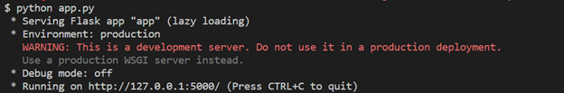
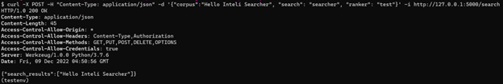
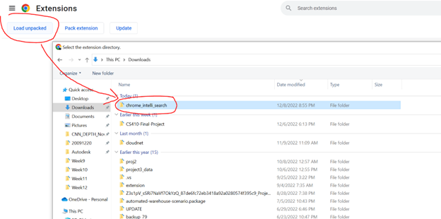

# CS410-Final-Project 
A chrome extension that indexes the current page to allow users to search over the page using common retrieval functions.

[Software Documentation](#implementation)

[Usage](#usage)

[Demo Video](https://www.youtube.com/watch?v=agyJ-4IclAc "Demo Video")

# Overview

The objective of this project is to develop a Chrome extension for intelligent browsing. Specifically, we developed a Chrome extension that indexes the current page to allow users to search over the page using the OkapiBM25 ranking function from the metapy package. In addition, we implemented a frontend UI that the users can use to input a search string, and the top 5 results are displayed back to the user.
The text preprocessing, cleaning, indexing, and ranking functionalities are handled in the backend flask-api using the metapy package.

## Implementation
The software is implemented in two components:

### (1) Frontend – Chrome extension

The core UI is implemented in popout.html and popout.css, consisting of the UI code for search and display results. The extension is located in the chrome_intelli_search folder.
backend.js file contains the event listeners to handle the search submission on click by extracting the text from the currently active tab. We utilize the chrome.scripting.executeScript to execute the text scraper functionality on the active window, POST and fetch data from the backend flask-api using the javascript ‘fetch’ method and dynamically render the resulting json results. We utilize basic HTML, CSS, Javascript, and default Chrome extension APIs to accomplish the frontend-backend communication and UI rendering.

### (2) Backend - Flask API server

The backend server is designed with Flask-API, and the text search indexing/ranking functionality is developed using the MetaPy packages. All the required packages to run the server are in the requirements.txt file. The server is run locally for the initial implementation is per user. The flask-API server is located in the flaskapi folder.

The Flask-API implements a /search route that expects at least two parameters, the raw text from the HTML page(corpus) and the search string. Optionally, a ranker option can be passed to test out other available rankers. However, for this project, we implement OkapiBM25 as the default ranker. 
The search engine pipeline is a three-stage pipeline with Preprocessing, tokenization/stemming, and indexing/ranking stages.

### Preprocessing Pipeline:
1. Split lines
2. Get rid of lines with one word or less
3.  Create data set each sentence in a line
4. Write to dataset file from the configuration file

### Tokenization/Stop Word removal/Stemming/N-Grams
We utilize the Metapy’s rich API to perform further preprocessing of the documents as follows:
1. ICUTokenizer  to tokenize raw text and provide an Iterable that spits out the individual text tokens.
2. Lowercase to convert all tokens to lowercase
3.  Porter2 Stemmer to  stemmer, or lemmatize the tokens by reducing the words from its inflections.
4. Ngram-word-1 to  bag of words” representation or “unigram word counts”.

### Indexing and Ranking

An inverted index is created using the metapy’s make_inverted_index function  and BM25 ranker is instantiated with the parameters k1=2.4, b=0.75 and k3=400.  A query document is created using the search string and the ranker is queried to score  and return the top-5 results.

#Project Environments:
1.	Python 3.7, Metapy, Flask-API
2.	Chrome


### Testing the Backend :
#### Sample Server Request/Response
```
$:~/code/admin/ill/CS410Text/CS410-CourseProject-Team-WXYZ/flaskapi
$ curl -X POST -H "Content-Type: application/json" -d '{"corpus":"Hello Inteli Searcher", "search": "searcher", "ranker": "test"}' -i http://127.0.0.1:5000/search
HTTP/1.0 200 OK
Content-Type: application/json
Content-Length: 45
Access-Control-Allow-Origin: *
Access-Control-Allow-Headers: Content-Type,Authorization
Access-Control-Allow-Methods: GET,PUT,POST,DELETE,OPTIONS
Access-Control-Allow-Credentials: true
Server: Werkzeug/1.0.0 Python/3.7.6
Date: Fri, 09 Dec 2022 04:30:45 GMT
```

```
{"search_results":["Hello Inteli Searcher"]}
```

# Usage:
#### Requirements: Python Version 3.7	

### 1.	Run Flask-API server
```
$cd /flaskapi

Optional: Setting pythong 3.7 environment in conda.

$ conda create -n testenv python=3.7
$ conda activate testenv

**This project was tested on python version 3.7. Please use a Python version 3.7 environment.

$ pip install -r requirements.txt
$ python app.py
``` 



Testing the API:

```
$ curl -X POST -H "Content-Type: application/json" -d '{"corpus":"Hello Inteli Searcher", "search": "searcher", "ranker": "test"}' -i http://127.0.0.1:5000/search
 ```



### 2.	Install Chrome Extension

 



### 3.	Browse, Search & Results
 


Items are highlighted once the user clicks on each of the search results. Items are not unhighlighted, however, until page is refreshed. 


### Contribution of Team:

All team members participated in all the  backend and frontend work. Lot of hours were spent on learning the technology and getting up to speed on tasks such as developing Chrome extensions and developing in Flask-API.
